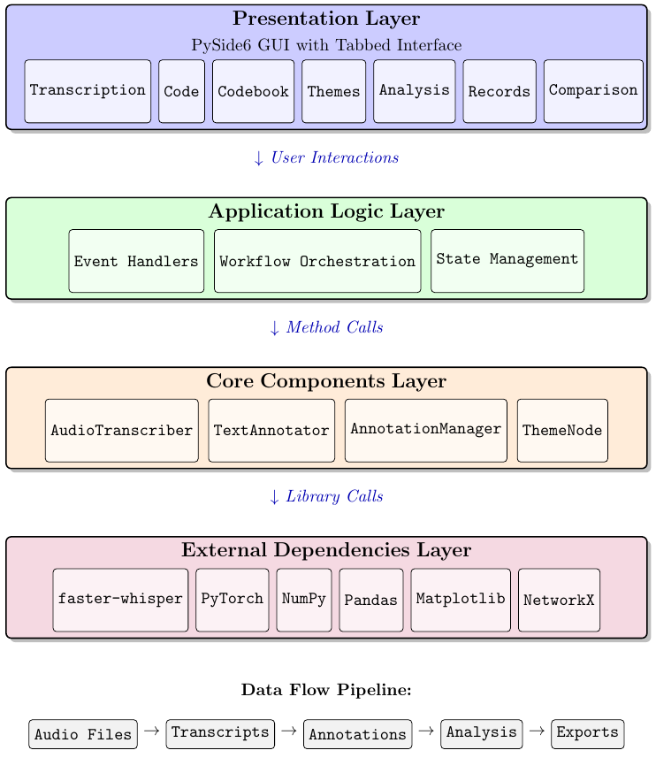
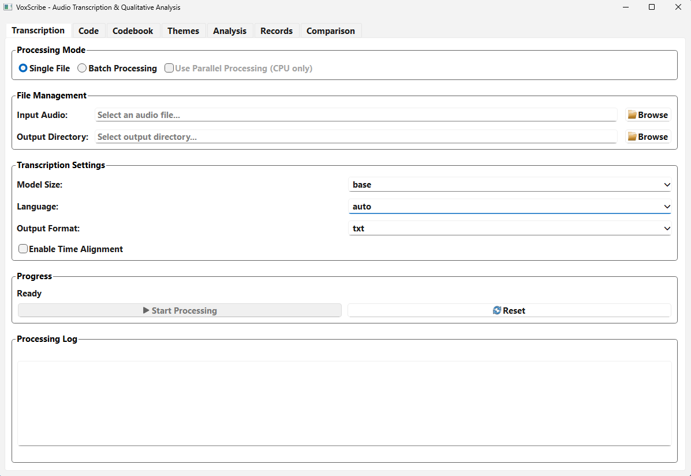
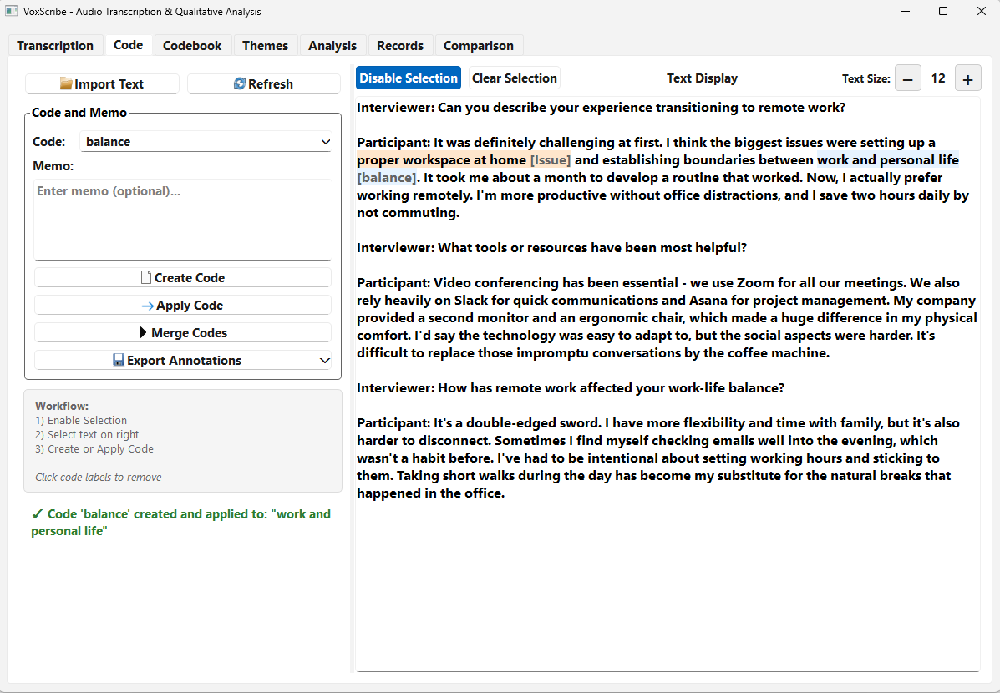
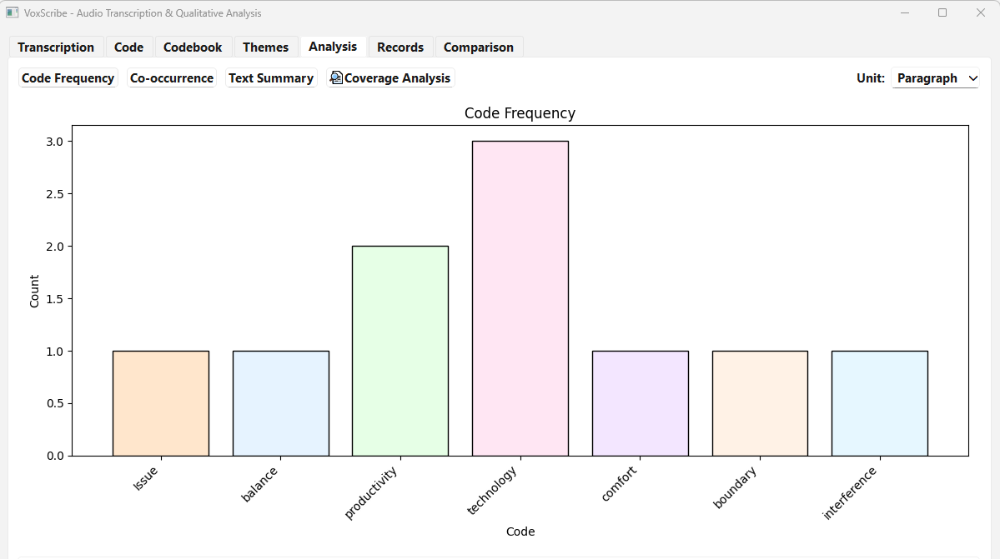
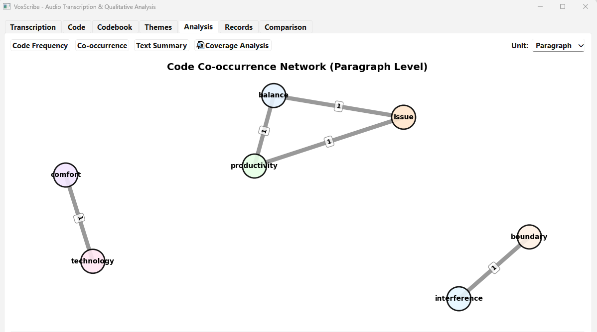
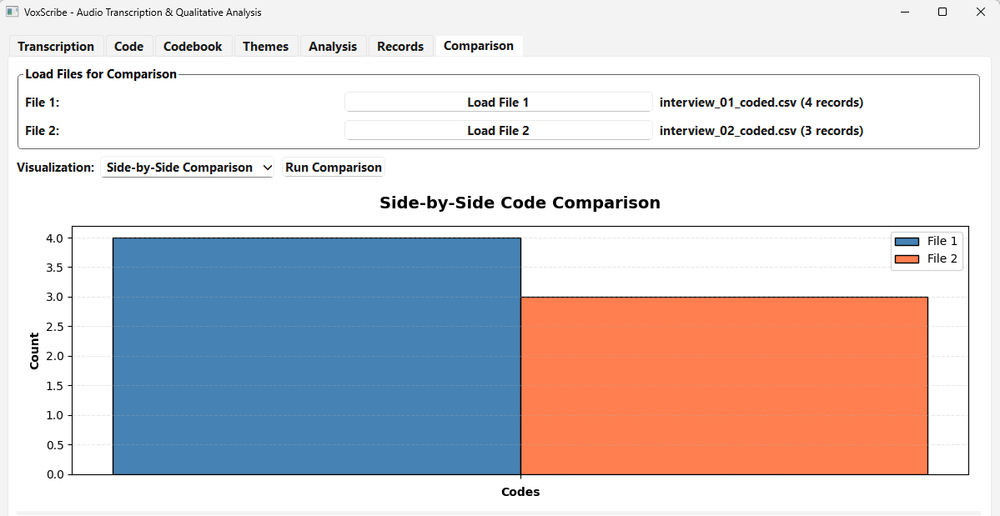

# Summary

VoxScribe is an integrated Python application that combines state-of-the-art automated audio transcription with comprehensive qualitative coding and analysis capabilities. Built on faster-whisper for accurate speech recognition and PySide6 for an intuitive graphical interface, VoxScribe addresses the critical gap between automated speech-to-text conversion and systematic qualitative data analysis. The software enables researchers, journalists, and qualitative analysts to seamlessly transcribe audio recordings and perform thematic coding, hierarchical theme development, and pattern analysis within a unified workflow. The goal of VoxScribe is to reduce the time and technical barriers associated with qualitative research workflows, and therefore make sophisticated analysis accessible to researchers without extensive technical expertise.

# Statement of need

The rapid growth in research output [@larsen2010rate; @michels2012growth] has created an increasing need for efficient tools to process and analyze large volumes of qualitative data. Audio-recorded interviews, focus groups, and ethnographic observations constitute primary data sources across social sciences, healthcare, education, and organizational studies, with studies commonly generating dozens to hundreds of hours of recordings that require transcription and analysis. The traditional qualitative research workflow presents significant practical challenges, particularly in the labor-intensive transcription phase, which requires approximately 6-10 hours of work per hour of audio [@saunders2009research].

## Current Research Tool Limitations

 **Manual processing barriers**: Qualitative researchers often struggle with the time-intensive nature of manual transcription and coding processes. Professional transcription requires substantial time investment which creates significant barriers for researchers. Commercial transcription services offer faster turnaround but at costs ranging from $60-180 per hour of audio [@Farmer2025TranscriptionCost; @VOMO2025Rates; @GMR2025Prices; @Verbit2025Rates], making large-scale studies financially prohibitive for many researchers, particularly graduate students and independent scholars.

**Technological fragmentation**: The evolution of research methodology tools demonstrates the importance of integrated approaches. While automatic speech recognition (ASR) technologies have dramatically improved, the adoption of automated transcription in qualitative research remains limited due to integration challenges. Because researchers often depend on different tools for transcription and subsequent analysis, the workflow becomes fragmented and difficult to manage.

**Methodological rigor concerns**: Research has shown that software tools must balance automation with methodological rigor [@Bringer2004Transparency; @Carcary2011CAQDAS; @Sinkovics2012CAQDAS; @Silver2016CAQDASLearningModel]. The discontinuation of RQDA [@huang2014rqda], a popular open-source qualitative data analysis tool, created significant gaps in the ecosystem. Current solutions present trade-offs:

- **Commercial QDA software** (ATLAS.ti, MAXQDA, NVivo) offers comprehensive functionality but presents cost barriers, workflow isolation from statistical environments, and reproducibility challenges due to proprietary formats
- **Open-source alternatives** address specific needs but leave important gaps: basic web interfaces lack statistical integration, command-line tools require programming expertise, and specialized tools focus on narrow use cases rather than comprehensive workflows

## The Integration Advantage

VoxScribe addresses these challenges by providing:

**Unified workflow**: Researchers can transcribe audio, perform qualitative coding, generate quantitative summaries, and create visualizations within a single environment, eliminating the need to export and import data across multiple platforms.

**Methodological transparency**: VoxScribe's graphical interface makes advanced transcription and analysis capabilities accessible to researchers without programming expertise, while maintaining the flexibility for technical users and ensuring transparent, reproducible workflows.

**Quality and efficiency**: In VoxScribe, all project data—transcripts, annotations, codes, and hierarchies—are stored in open, well-documented formats (JSON, CSV) to support programmatic access, version control, and transparent analytical workflows.

# Key Features and Functionality

VoxScribe provides comprehensive functionality for integrated transcription and qualitative analysis:

## Audio Processing and Transcription
- **Multi-format audio support**: MP3, WAV, M4A, FLAC, and other common formats
- **GPU-accelerated transcription**: Leverages faster-whisper with CUDA support for efficient processing
- **Flexible model selection**: Choose from base, small, medium, large models based on accuracy/speed requirements
- **Batch processing**: Process multiple files with queue management and progress tracking
- **Timestamp integration**: Precise audio-text synchronization for verification and analysis

## Interactive Qualitative Coding
- **Point-and-click annotation**: Select text segments and apply codes with immediate visual feedback
- **Hierarchical code organization**: Multi-level theme and code structures supporting complex analytical frameworks
- **Comprehensive memo system**: Attach detailed notes to coded segments with full-text search
- **Code merging and refinement**: Tools for consolidating and reorganizing analytical structures
- **Real-time highlighting**: Color-coded visualization of coded segments

## Analysis and Visualization
- **Code frequency analysis**: Statistical summaries of coding patterns and distributions
- **Co-occurrence analysis**: Network visualization of code relationships and patterns
- **Export capabilities**: Multiple formats (CSV, JSON, HTML) for integration with statistical software
- **Project management**: Save, load, and backup projects with version control features

# Implementation

VoxScribe is implemented in Python 3.8+ using a modular architecture that separates transcription, analysis, and interface components, following established principles for research software development [@Druskat2025BetterArchitecture]:

- `faster-whisper` for GPU-accelerated speech recognition with OpenAI Whisper models
- `PySide6` for cross-platform graphical user interface
- `pandas` and `numpy` for data management and analysis
- `networkx` for co-occurrence network analysis and visualization
- `matplotlib` for statistical plotting and visualization
- `soundfile` for audio file processing and format conversion

The application follows object-oriented design principles with clear separation between data models, business logic, and presentation layers. The transcription engine supports both CPU and GPU execution, automatically detecting available hardware and optimizing performance accordingly. The qualitative coding system employs efficient data structures for managing large numbers of annotations while maintaining real-time responsiveness in the user interface.

## System Architecture

The VoxScribe architecture comprises four primary layers, each with clearly defined responsibilities:

<p align="center">
  
</p>

**Layer 1: Presentation Layer**: The user-facing graphical interface developed with PySide6 and organized into seven tabbed views. Each tab is self-contained with its own controls, display areas, and event handlers. The interface employs progressive disclosure—showing advanced options only when needed—to preserve a clean and intuitive workspace while still allowing fine-grained control for experienced users.

**Layer 2: Application Logic Layer**: Orchestrates workflows, manages application state, and coordinates between the presentation layer and core components. This layer implements the actual research workflows (transcribe-then-code, import-and-analyze, batch-process) and guarantees data integrity and synchronization across all user views.

**Layer 3: Core Components Layer**: The essential functionality implemented through four primary components:
- `AudioTranscriber`: Executes Whisper model loading, device selection, and audio-to-text conversion
- `TextAnnotator`: Handles segment editing, annotation storage, and export formatting
- `AnnotationManager`: Oversees the creation, organization, and linkage of codes, themes, and conceptual relationships
- `ThemeNode`: Manages hierarchical theme organization as a tree data structure

**Layer 4: External Dependencies Layer**: Third-party libraries providing specialized functionality: faster-whisper for efficient model inference, PyTorch for neural network execution, NumPy/Pandas for data manipulation, Matplotlib for visualization, and NetworkX for graph analysis.

This layered architecture offers several benefits: Each component can be independently tested, the core logic is reusable through a Python API, and new features—such as additional tabs or enhanced modules—can be introduced without disrupting existing functionality.

VoxScribe requires Python 3.8+ and is compatible with Windows, macOS, and Linux. For optimal transcription performance, an NVIDIA GPU with 4GB+ VRAM is recommended, though CPU-only operation is supported. The software automatically manages model downloads and caching, requiring 1-10GB storage depending on selected models. More detailed documentation and installation instructions can be found on the Github page of the application: https://github.com/chaoliu-cl/voxscribe.

# Examples of Use

## Practical Workflow: Interview Analysis

To demonstrate VoxScribe's integrated capabilities, consider a researcher conducting interviews about remote work experiences:

### Project Setup and Audio Import
```python
# Launch VoxScribe GUI
python gui.py
```

The researcher imports interview recordings directly into the application, which automatically detects audio formats and prepares files for processing.

### Automated Transcription
VoxScribe processes the audio using faster-whisper, with the researcher selecting the appropriate model size based on accuracy requirements and computational resources. The transcription interface provides real-time progress updates and allows for batch processing of multiple interviews.

<p align="center">
  
</p>

### Interactive Coding and Analysis
Once transcription completes, the researcher can immediately begin qualitative coding within the same interface:

- **Text selection**: Click and drag to highlight relevant segments
- **Code application**: Create and apply codes such as "Issue" and "Balance"
- **Memo attachment**: Add detailed analytical notes to coded segments
- **Theme development**: Organize codes into hierarchical structures like "Issue" → "Challenges" → "Remote Work Disadvantages"

<p align="center">
  
</p>

### Pattern Analysis
VoxScribe's built-in analysis tools enable the researcher to:

- Generate frequency counts revealing that "technology" and "productivity" are dominant themes
<p align="center">
  
</p>
- Create co-occurrence networks showing relationships between concepts like "technology" and "comfort"
<p align="center">
  
</p>
- Export coded data for further statistical analysis in R or other environments

### Collaborative Analysis
For multi-coder projects, VoxScribe supports:

- Independent coding of the same transcripts by multiple researchers
- Comparison tools highlighting areas of agreement and disagreement
- Export of coding matrices for inter-rater reliability calculation

<p align="center">
  
</p>

This integrated workflow reduces a traditional multi-week process (transcription → coding → analysis) to a matter of days while maintaining analytical rigor and enabling more sophisticated pattern detection.

# Conclusion

VoxScribe addresses practical challenges in qualitative research by combining automated transcription with systematic coding tools in a single application. By integrating faster-whisper speech recognition with comprehensive qualitative analysis capabilities, the software reduces workflow fragmentation and makes advanced transcription technology more accessible to researchers. The emphasis on open data formats and transparent analytical processes supports reproducible research practices while maintaining the interpretive flexibility essential to qualitative inquiry. VoxScribe offers a practical solution for researchers managing increasing volumes of audio data, particularly those seeking to balance efficiency gains with methodological rigor. Continued development will focus on collaborative features and broader format support to further enhance the qualitative research workflow.